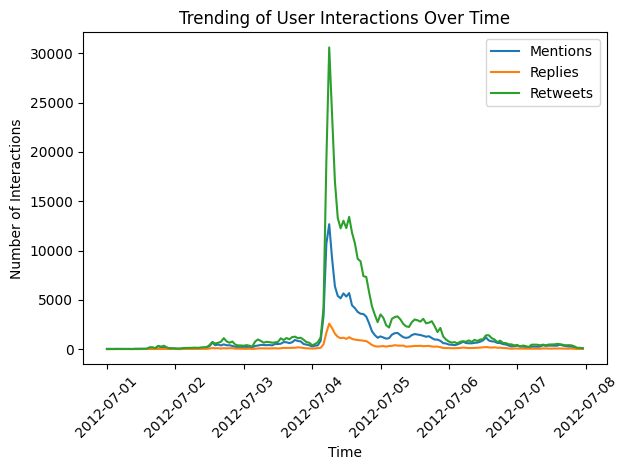

# Outbreak Detection

Outbreak detection by using CELF Algorithm

## Datasets

Put [higgs dataset files](https://snap.stanford.edu/data/higgs-twitter.html) in `dataset/`

## Code info

- `display_outbreak.py` Load activity information from `higgs-activity_time.txt`, display the trend of information explosion by month.

- `outbreak.py` Simulate outbreaks, as well as extract nodes from the known outbreak from higgs.

- `marginal_gain.py` penalty reduction calculation. NOT FINISHED.

- `algorithm.py` From https://github.com/hautahi/IM_GreedyCELF. NOT FINISHED.

- `combine_dataset.py` Needs to be adjusted

## TODOs

### Dataset preprocessing

- [ ] Count the number of followers for nodes in the retweet and mention graph.

- [ ] Simulate the cost of monitoring each node, create a new graph to indicate the cost

- [ ] Define a function to calculate penalty reduction - detection time, detection likelihood.

- [ ] Greedy/CELF algorithm

- [ ] heuristic approaches